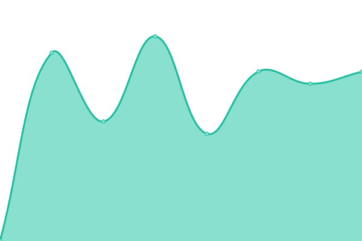
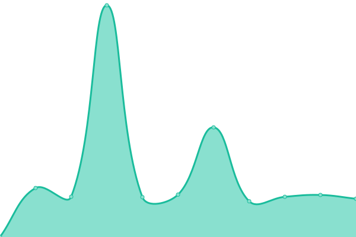
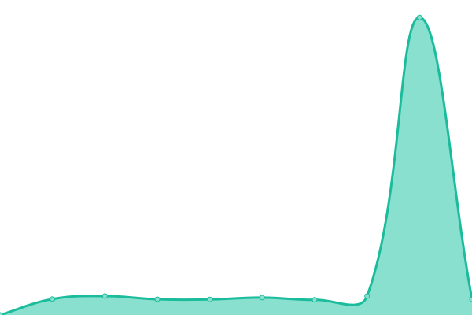
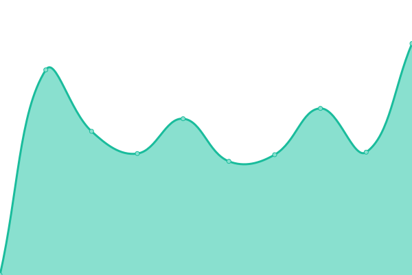
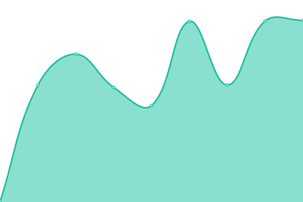
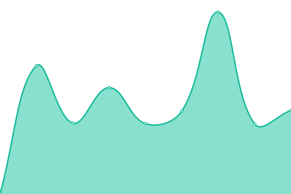
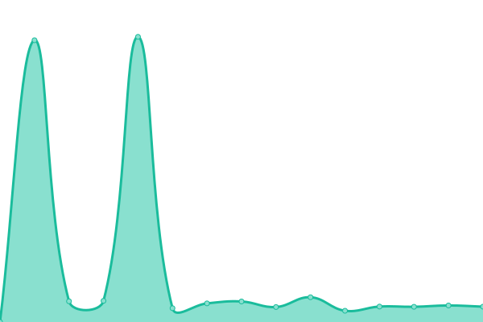
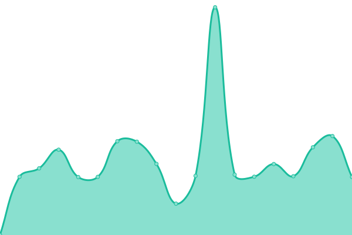
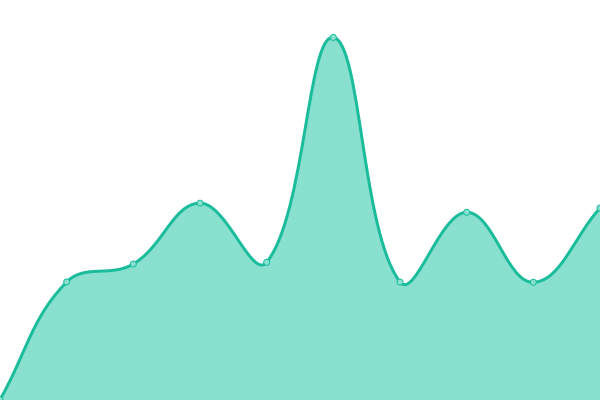

# [📈 Live Status](https://hupratt.github.io/upptime): <!--live status--> **🟧 Partial outage**

This repository contains the open-source uptime monitor and status page for [Hugo Pratt](https://www.craftstudios.eu/), powered by [Upptime](https://github.com/upptime/upptime).

With [Upptime](https://upptime.js.org), you can get your own unlimited and free uptime monitor and status page, powered entirely by a GitHub repository. We use [Issues](https://github.com/hupratt/upptime/issues) as incident reports, [Actions](https://github.com/hupratt/upptime/actions) as uptime monitors, and [Pages](https://hupratt.github.io/upptime) for the status page.

<!--start: status pages-->
<!-- This summary is generated by Upptime (https://github.com/upptime/upptime) -->
<!-- Do not edit this manually, your changes will be overwritten -->
<!-- prettier-ignore -->
| URL | Status | History | Response Time | Uptime |
| --- | ------ | ------- | ------------- | ------ |
|  [trello](https://trello.thekor.eu/) | 🟥 Down | [trello.yml](https://github.com/hupratt/upptime/commits/HEAD/history/trello.yml) | 

 699ms
     
 | 

<a href="https://hupratt.github.io/upptime/history/trello">86.37%</a>
    

|  [chirpy](https://chirpy.thekor.eu/) | 🟥 Down | [chirpy.yml](https://github.com/hupratt/upptime/commits/HEAD/history/chirpy.yml) | 

 770ms
     
 | 

<a href="https://hupratt.github.io/upptime/history/chirpy">86.38%</a>
    

|  [mealie](https://mealie.thekor.eu/) | 🟥 Down | [mealie.yml](https://github.com/hupratt/upptime/commits/HEAD/history/mealie.yml) | 

 542ms
     
 | 

<a href="https://hupratt.github.io/upptime/history/mealie">86.39%</a>
    

|  [recipes](https://recipes.thekor.eu/) | 🟥 Down | [recipes.yml](https://github.com/hupratt/upptime/commits/HEAD/history/recipes.yml) | 

 1045ms
     
 | 

<a href="https://hupratt.github.io/upptime/history/recipes">86.40%</a>
    

|  [Posthog](https://posthog.thekor.eu/setup_admin) | 🟥 Down | [posthog.yml](https://github.com/hupratt/upptime/commits/HEAD/history/posthog.yml) | 

 697ms
     
 | 

<a href="https://hupratt.github.io/upptime/history/posthog">86.40%</a>
    

|  [Stream HLS encoding (slow)](https://live.thekor.eu/) | 🟥 Down | [stream-hls-encoding-slow.yml](https://github.com/hupratt/upptime/commits/HEAD/history/stream-hls-encoding-slow.yml) | 

 643ms
     
 | 

<a href="https://hupratt.github.io/upptime/history/stream-hls-encoding-slow">86.41%</a>
    

|  [WebRTC encoding (fast)](https://rtc.thekor.eu/) | 🟥 Down | [web-rtc-encoding-fast.yml](https://github.com/hupratt/upptime/commits/HEAD/history/web-rtc-encoding-fast.yml) | 

 557ms
     
 | 

<a href="https://hupratt.github.io/upptime/history/web-rtc-encoding-fast">86.42%</a>
    

|  [Portfolio](https://portfolio.thekor.eu) | 🟥 Down | [portfolio.yml](https://github.com/hupratt/upptime/commits/HEAD/history/portfolio.yml) | 

 1121ms
     
 | 

<a href="https://hupratt.github.io/upptime/history/portfolio">86.43%</a>
    

|  [Blog](https://blog.thekor.eu/) | 🟩 Up | [blog.yml](https://github.com/hupratt/upptime/commits/HEAD/history/blog.yml) | 

 908ms
     
 | 

<a href="https://hupratt.github.io/upptime/history/blog">86.46%</a>
    

|  [Coach](https://coach.thekor.eu/) | 🟩 Up | [coach.yml](https://github.com/hupratt/upptime/commits/HEAD/history/coach.yml) | 

 719ms
     
 | 

<a href="https://hupratt.github.io/upptime/history/coach">86.46%</a>
    

|  [Booking](https://booking.thekor.eu/en/) | 🟩 Up | [booking.yml](https://github.com/hupratt/upptime/commits/HEAD/history/booking.yml) | 

 545ms
     
 | 

<a href="https://hupratt.github.io/upptime/history/booking">86.47%</a>
    

|  [Makita](https://makita.thekor.eu/) | 🟩 Up | [makita.yml](https://github.com/hupratt/upptime/commits/HEAD/history/makita.yml) | 

 1011ms
     
 | 

<a href="https://hupratt.github.io/upptime/history/makita">86.48%</a>
    

|  [Split a bill](https://bill.thekor.eu/) | 🟩 Up | [split-a-bill.yml](https://github.com/hupratt/upptime/commits/HEAD/history/split-a-bill.yml) | 

 514ms
     
 | 

<a href="https://hupratt.github.io/upptime/history/split-a-bill">86.49%</a>
    

|  [Mortgage Calculator](https://minio-api.thekor.eu/mortgage-calculator-f1492f08-f236-4a55-afb7-70ded209cb27/index.html) | 🟩 Up | [mortgage-calculator.yml](https://github.com/hupratt/upptime/commits/HEAD/history/mortgage-calculator.yml) | 

 522ms
     
 | 

<a href="https://hupratt.github.io/upptime/history/mortgage-calculator">100.00%</a>
    

|  [CV](https://minio-api.thekor.eu/rihab-f1492f08-f236-4a55-afb7-70ded209cb24/rihab/index.html) | 🟩 Up | [cv.yml](https://github.com/hupratt/upptime/commits/HEAD/history/cv.yml) | 

 116ms
     
 | 

<a href="https://hupratt.github.io/upptime/history/cv">100.00%</a>
    

|  [netchicks](https://minio-api.thekor.eu/netchicks-f1492f08-f236-4a55-afb7-70ded209cb27/Netchicks/index.html) | 🟩 Up | [netchicks.yml](https://github.com/hupratt/upptime/commits/HEAD/history/netchicks.yml) | 

 114ms
     
 | 

<a href="https://hupratt.github.io/upptime/history/netchicks">100.00%</a>
    

|  [youtubeclone](https://youtube.thekor.eu/) | 🟩 Up | [youtubeclone.yml](https://github.com/hupratt/upptime/commits/HEAD/history/youtubeclone.yml) | 

 524ms
     
 | 

<a href="https://hupratt.github.io/upptime/history/youtubeclone">86.50%</a>
    

|  [bitwarden](https://vault.thekor.eu/) | 🟩 Up | [bitwarden.yml](https://github.com/hupratt/upptime/commits/HEAD/history/bitwarden.yml) | 

 558ms
     
 | 

<a href="https://hupratt.github.io/upptime/history/bitwarden">86.51%</a>
    

|  [retro](https://retro.thekor.eu/) | 🟩 Up | [retro.yml](https://github.com/hupratt/upptime/commits/HEAD/history/retro.yml) | 

 529ms
     
 | 

<a href="https://hupratt.github.io/upptime/history/retro">86.52%</a>
    

|  [shop](https://lapetiteportugaise.thekor.eu) | 🟩 Up | [shop.yml](https://github.com/hupratt/upptime/commits/HEAD/history/shop.yml) | 

 592ms
     
 | 

<a href="https://hupratt.github.io/upptime/history/shop">97.54%</a>
    

|  [spotify](https://spotifyapi.thekor.eu) | 🟩 Up | [spotify.yml](https://github.com/hupratt/upptime/commits/HEAD/history/spotify.yml) | 

 499ms
     
 | 

<a href="https://hupratt.github.io/upptime/history/spotify">86.54%</a>
    

|  [homeassistant](https://home.thekor.eu) | 🟩 Up | [homeassistant.yml](https://github.com/hupratt/upptime/commits/HEAD/history/homeassistant.yml) | 

 497ms
     
 | 

<a href="https://hupratt.github.io/upptime/history/homeassistant">86.55%</a>
    

|  [mail](https://mail.thekor.eu) | 🟩 Up | [mail.yml](https://github.com/hupratt/upptime/commits/HEAD/history/mail.yml) | 

 658ms
     
 | 

<a href="https://hupratt.github.io/upptime/history/mail">100.00%</a>
    

|  [guacamole](https://remote.thekor.eu) | 🟩 Up | [guacamole.yml](https://github.com/hupratt/upptime/commits/HEAD/history/guacamole.yml) | 

 528ms
     
 | 

<a href="https://hupratt.github.io/upptime/history/guacamole">100.00%</a>
    

|  [kuma](https://uptime.thekor.eu/status/cloud) | 🟩 Up | [kuma.yml](https://github.com/hupratt/upptime/commits/HEAD/history/kuma.yml) | 

 554ms
     
 | 

<a href="https://hupratt.github.io/upptime/history/kuma">86.56%</a>
    

|  [kibana](https://kibana.thekor.eu) | 🟥 Down | [kibana.yml](https://github.com/hupratt/upptime/commits/HEAD/history/kibana.yml) | 

 862ms
     
 | 

<a href="https://hupratt.github.io/upptime/history/kibana">44.80%</a>
    

|  [elastic](https://elastic.thekor.eu/.watcher*/_search?pretty) | 🟥 Down | [elastic.yml](https://github.com/hupratt/upptime/commits/HEAD/history/elastic.yml) | 

 542ms
     
 | 

<a href="https://hupratt.github.io/upptime/history/elastic">44.82%</a>
    

|  [kuma hz](https://uptime-hz.thekor.eu/status/cloud-hz) | 🟩 Up | [kuma-hz.yml](https://github.com/hupratt/upptime/commits/HEAD/history/kuma-hz.yml) | 

 473ms
     
 | 

<a href="https://hupratt.github.io/upptime/history/kuma-hz">100.00%</a>
    

|  [minio](https://minio.thekor.eu) | 🟩 Up | [minio.yml](https://github.com/hupratt/upptime/commits/HEAD/history/minio.yml) | 

 458ms
     
 | 

<a href="https://hupratt.github.io/upptime/history/minio">100.00%</a>
    

<!--end: status pages-->

[**Visit our status website →**](https://hupratt.github.io/upptime)

## 📄 License

- Powered by: [Upptime](https://github.com/upptime/upptime)
- Code: [MIT](./LICENSE) © [Hugo Pratt](https://www.craftstudios.eu/)
- Data in the `./history` directory: [Open Database License](https://opendatacommons.org/licenses/odbl/1-0/)
