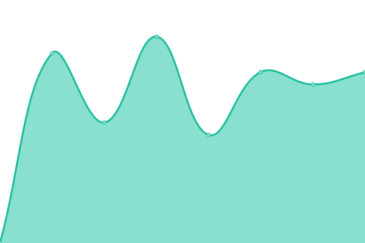
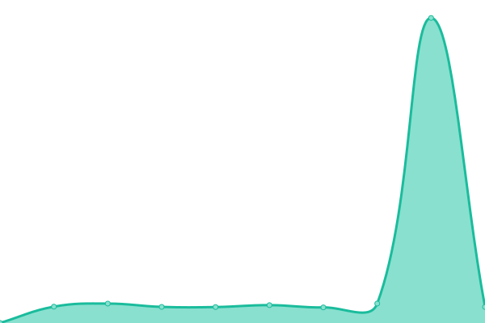
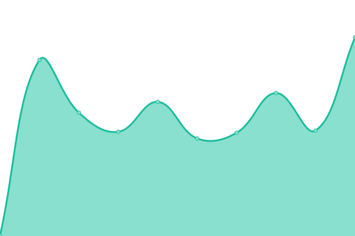

# [📈 Live Status](https://hupratt.github.io/upptime): <!--live status--> **🟧 Partial outage**

This repository contains the open-source uptime monitor and status page for [Hugo Pratt](https://www.craftstudios.eu/), powered by [Upptime](https://github.com/upptime/upptime).

With [Upptime](https://upptime.js.org), you can get your own unlimited and free uptime monitor and status page, powered entirely by a GitHub repository. We use [Issues](https://github.com/hupratt/upptime/issues) as incident reports, [Actions](https://github.com/hupratt/upptime/actions) as uptime monitors, and [Pages](https://hupratt.github.io/upptime) for the status page.

<!--start: status pages-->
<!-- This summary is generated by Upptime (https://github.com/upptime/upptime) -->
<!-- Do not edit this manually, your changes will be overwritten -->
<!-- prettier-ignore -->
| URL | Status | History | Response Time | Uptime |
| --- | ------ | ------- | ------------- | ------ |
|  [trello](https://trello.thekor.eu/) | 🟩 Up | [trello.yml](https://github.com/hupratt/upptime/commits/HEAD/history/trello.yml) | 

 1029ms
     
 | 

<a href="https://hupratt.github.io/upptime/history/trello">99.48%</a>
    

|  [chirpy](https://chirpy.thekor.eu/) | 🟩 Up | [chirpy.yml](https://github.com/hupratt/upptime/commits/HEAD/history/chirpy.yml) | 

 1218ms
     
 | 

<a href="https://hupratt.github.io/upptime/history/chirpy">98.07%</a>
    

|  [Posthog](https://posthog.thekor.eu/setup_admin) | 🟩 Up | [posthog.yml](https://github.com/hupratt/upptime/commits/HEAD/history/posthog.yml) | 

 1089ms
     
 | 

<a href="https://hupratt.github.io/upptime/history/posthog">100.00%</a>
    

|  [Stream HLS encoding (slow)](https://live.thekor.eu/) | 🟩 Up | [stream-hls-encoding-slow.yml](https://github.com/hupratt/upptime/commits/HEAD/history/stream-hls-encoding-slow.yml) | 

 681ms
     
 | 

<a href="https://hupratt.github.io/upptime/history/stream-hls-encoding-slow">100.00%</a>
    

|  [WebRTC encoding (fast)](https://rtc.thekor.eu/) | 🟩 Up | [web-rtc-encoding-fast.yml](https://github.com/hupratt/upptime/commits/HEAD/history/web-rtc-encoding-fast.yml) | 

 773ms
     
 | 

<a href="https://hupratt.github.io/upptime/history/web-rtc-encoding-fast">100.00%</a>
    

|  [Portfolio](https://portfolio.thekor.eu) | 🟩 Up | [portfolio.yml](https://github.com/hupratt/upptime/commits/HEAD/history/portfolio.yml) | 

 1179ms
     
 | 

<a href="https://hupratt.github.io/upptime/history/portfolio">98.96%</a>
    

|  [Booking](https://booking.thekor.eu/en/) | 🟩 Up | [booking.yml](https://github.com/hupratt/upptime/commits/HEAD/history/booking.yml) | 

 701ms
     
 | 

<a href="https://hupratt.github.io/upptime/history/booking">98.96%</a>
    

|  [Makita](https://makita.thekor.eu/) | 🟩 Up | [makita.yml](https://github.com/hupratt/upptime/commits/HEAD/history/makita.yml) | 

 775ms
     
 | 

<a href="https://hupratt.github.io/upptime/history/makita">98.96%</a>
    

|  [Mortgage Calculator](https://minio-api.thekor.eu/mortgage-calculator-f1492f08-f236-4a55-afb7-70ded209cb27/index.html) | 🟩 Up | [mortgage-calculator.yml](https://github.com/hupratt/upptime/commits/HEAD/history/mortgage-calculator.yml) | 

 819ms
     
 | 

<a href="https://hupratt.github.io/upptime/history/mortgage-calculator">100.00%</a>
    

|  [CV](https://minio-api.thekor.eu/rihab-f1492f08-f236-4a55-afb7-70ded209cb24/rihab/index.html) | 🟩 Up | [cv.yml](https://github.com/hupratt/upptime/commits/HEAD/history/cv.yml) | 

 232ms
     
 | 

<a href="https://hupratt.github.io/upptime/history/cv">100.00%</a>
    

|  [netchicks](https://minio-api.thekor.eu/netchicks-f1492f08-f236-4a55-afb7-70ded209cb27/Netchicks/index.html) | 🟩 Up | [netchicks.yml](https://github.com/hupratt/upptime/commits/HEAD/history/netchicks.yml) | 

 119ms
     
 | 

<a href="https://hupratt.github.io/upptime/history/netchicks">100.00%</a>
    

|  [youtubeclone](https://youtube.thekor.eu/) | 🟩 Up | [youtubeclone.yml](https://github.com/hupratt/upptime/commits/HEAD/history/youtubeclone.yml) | 

 537ms
     
 | 

<a href="https://hupratt.github.io/upptime/history/youtubeclone">100.00%</a>
    

|  [retro](https://retro.thekor.eu/) | 🟩 Up | [retro.yml](https://github.com/hupratt/upptime/commits/HEAD/history/retro.yml) | 

 1560ms
     
 | 

<a href="https://hupratt.github.io/upptime/history/retro">94.90%</a>
    

|  [shop](https://lapetiteportugaise.thekor.eu) | 🟩 Up | [shop.yml](https://github.com/hupratt/upptime/commits/HEAD/history/shop.yml) | 

 726ms
     
 | 

<a href="https://hupratt.github.io/upptime/history/shop">100.00%</a>
    

|  [spotify](https://spotify.thekor.eu) | 🟥 Down | [spotify.yml](https://github.com/hupratt/upptime/commits/HEAD/history/spotify.yml) | 

 589ms
     
 | 

<a href="https://hupratt.github.io/upptime/history/spotify">94.89%</a>
    

|  [homeassistant](https://home.thekor.eu) | 🟩 Up | [homeassistant.yml](https://github.com/hupratt/upptime/commits/HEAD/history/homeassistant.yml) | 

 2008ms
     
 | 

<a href="https://hupratt.github.io/upptime/history/homeassistant">99.73%</a>
    

|  [mail](https://mail.thekor.eu) | 🟩 Up | [mail.yml](https://github.com/hupratt/upptime/commits/HEAD/history/mail.yml) | 

 746ms
     
 | 

<a href="https://hupratt.github.io/upptime/history/mail">100.00%</a>
    

|  [guacamole](https://remote.thekor.eu/guacamole/) | 🟩 Up | [guacamole.yml](https://github.com/hupratt/upptime/commits/HEAD/history/guacamole.yml) | 

 775ms
     
 | 

<a href="https://hupratt.github.io/upptime/history/guacamole">100.00%</a>
    

|  [minio](https://minio.thekor.eu) | 🟩 Up | [minio.yml](https://github.com/hupratt/upptime/commits/HEAD/history/minio.yml) | 

 581ms
     
 | 

<a href="https://hupratt.github.io/upptime/history/minio">100.00%</a>
    

<!--end: status pages-->

[**Visit our status website →**](https://hupratt.github.io/upptime)

## 📄 License

- Powered by: [Upptime](https://github.com/upptime/upptime)
- Code: [MIT](./LICENSE) © [Hugo Pratt](https://www.craftstudios.eu/)
- Data in the `./history` directory: [Open Database License](https://opendatacommons.org/licenses/odbl/1-0/)
