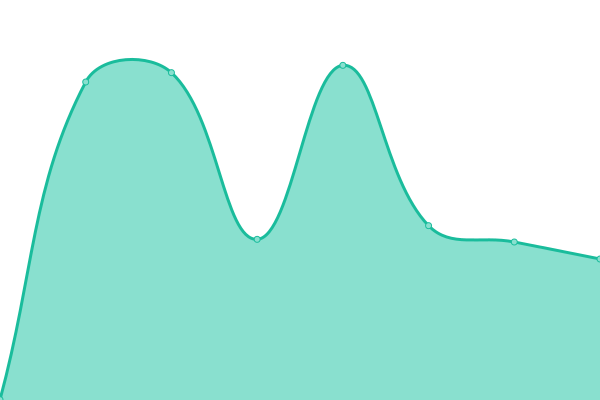

# [📈 Live Status](https://hupratt.github.io/upptime): <!--live status--> **🟩 All systems operational**

This repository contains the open-source uptime monitor and status page for [Hugo Pratt](https://www.craftstudios.eu/), powered by [Upptime](https://github.com/upptime/upptime).

With [Upptime](https://upptime.js.org), you can get your own unlimited and free uptime monitor and status page, powered entirely by a GitHub repository. We use [Issues](https://github.com/hupratt/upptime/issues) as incident reports, [Actions](https://github.com/hupratt/upptime/actions) as uptime monitors, and [Pages](https://hupratt.github.io/upptime) for the status page.

<!--start: status pages-->
<!-- This summary is generated by Upptime (https://github.com/upptime/upptime) -->
<!-- Do not edit this manually, your changes will be overwritten -->
<!-- prettier-ignore -->
| URL | Status | History | Response Time | Uptime |
| --- | ------ | ------- | ------------- | ------ |
|  [trello](https://trello.craftstudios.shop/) | 🟩 Up | [trello.yml](https://github.com/hupratt/upptime/commits/HEAD/history/trello.yml) | 

 2125ms
     
 | 

<a href="https://hupratt.github.io/upptime/history/trello">97.02%</a>
    

|  [chirpy](https://chirpy.craftstudios.shop/) | 🟩 Up | [chirpy.yml](https://github.com/hupratt/upptime/commits/HEAD/history/chirpy.yml) | 

 2473ms
     
 | 

<a href="https://hupratt.github.io/upptime/history/chirpy">96.87%</a>
    

|  [mealie](https://mealie.craftstudios.shop/) | 🟩 Up | [mealie.yml](https://github.com/hupratt/upptime/commits/HEAD/history/mealie.yml) | 

 2701ms
     
 | 

<a href="https://hupratt.github.io/upptime/history/mealie">97.00%</a>
    

|  [recipes](https://recipes.craftstudios.shop/) | 🟩 Up | [recipes.yml](https://github.com/hupratt/upptime/commits/HEAD/history/recipes.yml) | 

 3713ms
     
 | 

<a href="https://hupratt.github.io/upptime/history/recipes">97.71%</a>
    

|  [Posthog](https://posthog.craftstudios.shop/setup_admin) | 🟩 Up | [posthog.yml](https://github.com/hupratt/upptime/commits/HEAD/history/posthog.yml) | 

 2135ms
     
 | 

<a href="https://hupratt.github.io/upptime/history/posthog">97.76%</a>
    

|  [Stream HLS encoding (slow)](https://live.craftstudios.shop/) | 🟩 Up | [stream-hls-encoding-slow.yml](https://github.com/hupratt/upptime/commits/HEAD/history/stream-hls-encoding-slow.yml) | 

 2827ms
     
 | 

<a href="https://hupratt.github.io/upptime/history/stream-hls-encoding-slow">97.56%</a>
    

|  [WebRTC encoding (fast)](https://rtc.craftstudios.shop/) | 🟩 Up | [web-rtc-encoding-fast.yml](https://github.com/hupratt/upptime/commits/HEAD/history/web-rtc-encoding-fast.yml) | 

 2304ms
     
 | 

<a href="https://hupratt.github.io/upptime/history/web-rtc-encoding-fast">97.43%</a>
    

|  [Portfolio](https://www.craftstudios.shop/) | 🟩 Up | [portfolio.yml](https://github.com/hupratt/upptime/commits/HEAD/history/portfolio.yml) | 

 2992ms
     
 | 

<a href="https://hupratt.github.io/upptime/history/portfolio">96.85%</a>
    

|  [Blog](https://blog.craftstudios.shop/) | 🟩 Up | [blog.yml](https://github.com/hupratt/upptime/commits/HEAD/history/blog.yml) | 

 1409ms
     
 | 

<a href="https://hupratt.github.io/upptime/history/blog">97.42%</a>
    

|  [Coach](https://coach.craftstudios.shop/) | 🟩 Up | [coach.yml](https://github.com/hupratt/upptime/commits/HEAD/history/coach.yml) | 

 2011ms
     
 | 

<a href="https://hupratt.github.io/upptime/history/coach">97.18%</a>
    

|  [Booking](https://booking.craftstudios.shop/en/) | 🟩 Up | [booking.yml](https://github.com/hupratt/upptime/commits/HEAD/history/booking.yml) | 

 2611ms
     
 | 

<a href="https://hupratt.github.io/upptime/history/booking">96.72%</a>
    

|  [Makita](https://makita.craftstudios.shop/) | 🟩 Up | [makita.yml](https://github.com/hupratt/upptime/commits/HEAD/history/makita.yml) | 

 2774ms
     
 | 

<a href="https://hupratt.github.io/upptime/history/makita">97.61%</a>
    

|  [Split a bill](https://bill.craftstudios.shop/) | 🟩 Up | [split-a-bill.yml](https://github.com/hupratt/upptime/commits/HEAD/history/split-a-bill.yml) | 

 1685ms
     
 | 

<a href="https://hupratt.github.io/upptime/history/split-a-bill">97.21%</a>
    

|  [Mortgage Calculator](https://mortgage-calculator-f1492f08-f236-4a55-afb7-70ded209cb27.s3.eu-north-1.amazonaws.com/index.html) | 🟩 Up | [mortgage-calculator.yml](https://github.com/hupratt/upptime/commits/HEAD/history/mortgage-calculator.yml) | 

 645ms
     
 | 

<a href="https://hupratt.github.io/upptime/history/mortgage-calculator">100.00%</a>
    

|  [CV](https://rihab-f1492f08-f236-4a55-afb7-70ded209cb24.s3.eu-north-1.amazonaws.com/rihab-CV/index.html) | 🟩 Up | [cv.yml](https://github.com/hupratt/upptime/commits/HEAD/history/cv.yml) | 

 647ms
     
 | 

<a href="https://hupratt.github.io/upptime/history/cv">100.00%</a>
    

|  [netchicks](https://netchicks-f1492f08-f236-4a55-afb7-70ded209cb27.s3.eu-north-1.amazonaws.com/Netchicks/index.html) | 🟩 Up | [netchicks.yml](https://github.com/hupratt/upptime/commits/HEAD/history/netchicks.yml) | 

 697ms
     
 | 

<a href="https://hupratt.github.io/upptime/history/netchicks">100.00%</a>
    

|  [youtubeclone](https://youtube.craftstudios.shop/) | 🟩 Up | [youtubeclone.yml](https://github.com/hupratt/upptime/commits/HEAD/history/youtubeclone.yml) | 

 2125ms
     
 | 

<a href="https://hupratt.github.io/upptime/history/youtubeclone">97.40%</a>
    

|  [bitwarden](https://bitwarden.craftstudios.shop/) | 🟩 Up | [bitwarden.yml](https://github.com/hupratt/upptime/commits/HEAD/history/bitwarden.yml) | 

 2242ms
     
 | 

<a href="https://hupratt.github.io/upptime/history/bitwarden">97.41%</a>
    

|  [retro](https://retro.craftstudios.shop/) | 🟩 Up | [retro.yml](https://github.com/hupratt/upptime/commits/HEAD/history/retro.yml) | 

 2335ms
     
 | 

<a href="https://hupratt.github.io/upptime/history/retro">98.46%</a>
    

|  [shop](https://lapetiteportugaise.bitwcmd.duckdns.org) | 🟩 Up | [shop.yml](https://github.com/hupratt/upptime/commits/HEAD/history/shop.yml) | 

 1693ms
     
 | 

<a href="https://hupratt.github.io/upptime/history/shop">97.15%</a>
    

|  [spotify](https://spotify.craftstudios.shop) | 🟩 Up | [spotify.yml](https://github.com/hupratt/upptime/commits/HEAD/history/spotify.yml) | 

 1967ms
     
 | 

<a href="https://hupratt.github.io/upptime/history/spotify">97.50%</a>
    

<!--end: status pages-->

[**Visit our status website →**](https://hupratt.github.io/upptime)

## 📄 License

- Powered by: [Upptime](https://github.com/upptime/upptime)
- Code: [MIT](./LICENSE) © [Hugo Pratt](https://www.craftstudios.eu/)
- Data in the `./history` directory: [Open Database License](https://opendatacommons.org/licenses/odbl/1-0/)
